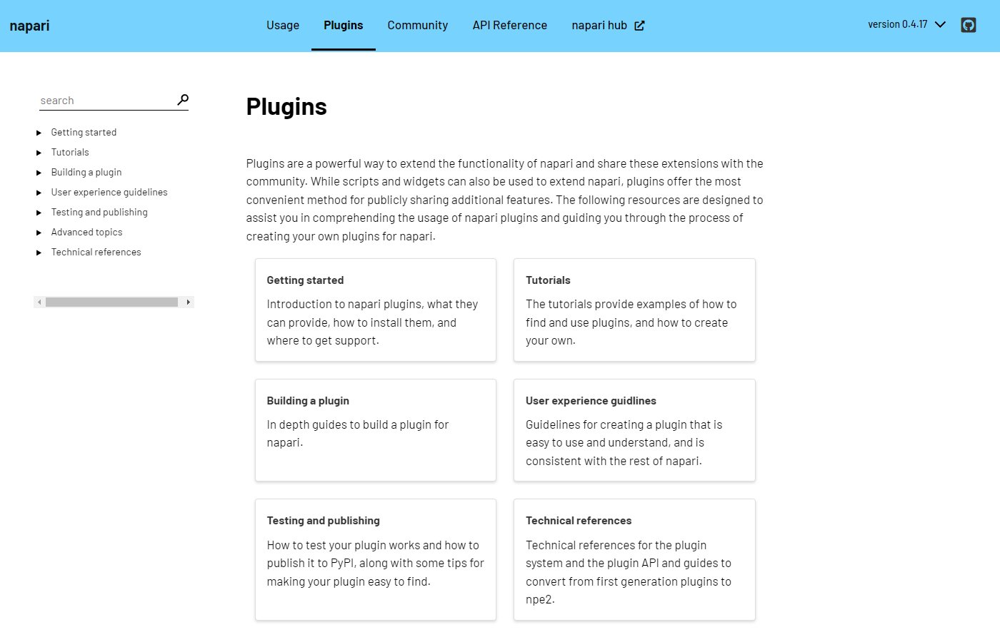
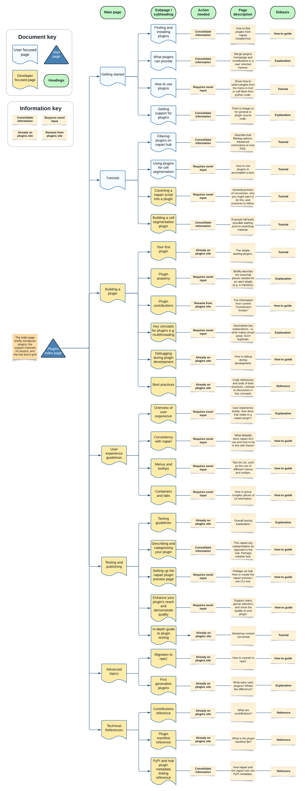
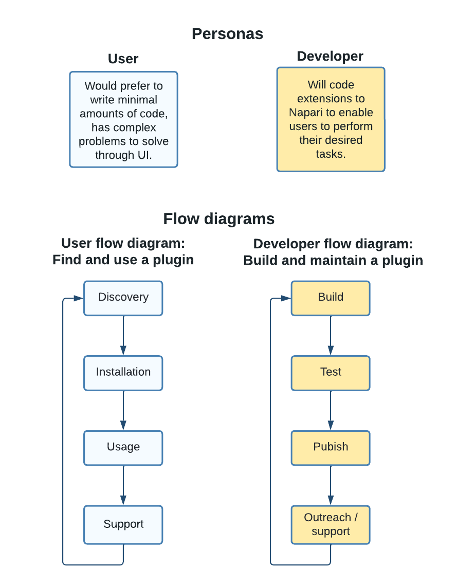

# Reorganising and Improving Plugin Documentation

## 📚 New content request

Hello everyone!

The napari plugin ecosystem and the content at [napari.org/plugins](https://napari.org/dev/plugins) have been growing rapidly, and it would be beneficial to reorganize the plugin documentation to improve navigation. Here is a proposal for restructuring the existing plugin-related content and introducing new valuable information. Please add any suggestions or comments on this - I'd love to hear your thoughts!

### Mock-up of the plugins main page

Here is a mock-up of the proposed site layout at a top level:

### Proposed plugin documentation structure

Click to view the full plugin site layout proposal

---

Click to view the proposed table of contents

* Getting started
  * Finding and installing plugins
  * What plugins can provide
  * How to use plugins
  * Getting support for plugins
* Tutorials
  * Filtering plugins on napari hub
  * Using plugins for cell segmentation
  * Converting a napari script into a plugin
  * Building a full plugin
* Building a plugin
  * Your first plugin
  * Plugin anatomy
  * Plugin contributions
  * Key concepts for plugins (e.g. multithreading)
  * Debugging during plugin development
  * Best practices
* User experience guidelines
  * Overview of user experience
  * Consistency with napari
  * Menus and tooltips
  * Containers and tabs
* Testing and publishing
  * Testing guidelines
  * Describing and categorising your plugin
  * Setting up the napari hub plugin preview page
  * Enhance your plugin's reach and demonstrate quality
  * In depth-guide to plugin testing (converted workshop content)
* Advanced topics
  * Migration to npe2
  * First generation plugins
* Technical references
  * Plugin contributions reference
  * Plugin manifest reference
  * PyPI and napari hub metadata linking reference

### How this proposal was developed

The proposed reorganisation and new pages have tried to follow the ideas from the [Diátaxis framework](https://diataxis.fr/), splitting documentation into Tutorials (step by step lessons or learning experiences), How-to guides (directions to solve specific problems), Explanations (understanding oriented discussions), and Reference (information-oriented technical descriptions) pages.
The layout draws inspiration from the documentation of other open source projects with plugin or extension capabilities, napari plugin related content in external sites, and the recent updates to the [napari.org](https://napari.org) site to use grid layouts on index pages.
This layout aims to achieve two main objectives:

#### Aim 1: align documentation with user/developer flow

---

Click to view personas and flow diagrams

---

The goal is to divide the documentation into pages that cater to either users or developers.
We assume that plugin users want to discover, install, and effectively utilise plugins to solve their problems.
On the other hand, plugin developers want to build and maintain plugins to support the users.
The documentation should align with the typical flow for both users and developers, considering that these groups are not mutually exclusive.
Additionally, this division between users and developers can also help describe when a user might consider becoming a plugin developer, how to do so, and what makes a great plugin.
For example, this information would be useful if a user wants to share their napari script or widget with others or contribute to an existing plugin.

#### Aim 2: centralise plugin information

Currently, there is a wealth of information for plugin users and developers, but it is somewhat scattered.
The goal is to centralise this information on the plugins site.
Importantly, the aim is not to duplicate content on [napari.org](https://napari.org) but to provide short summaries and cross-link to the relevant main information page.
At the end of this issue, you'll find a non-exhaustive table which lists many of the current resources that are available for plugin developers and users.

### The location of napari hub related documentation

The proposal includes incorporating some [napari hub](https://www.napari-hub.org/) related documentation on the napari site.
This is in an effort to encapsulate information in one highly discoverable documentation area, benefiting both the typical user journey, which often involves finding plugins on the napari hub, and the typical developer journey, which usually ends with publishing their package to PyPI and the napari hub.
By placing napari hub related information on the napari site, it may make it clearer how to use the built in napari functionality (such as the plugin installer menu) in conjunction with or separately from the napari hub.
Additionally, it will help clarify the usage of plugin metadata by napari itself, its usage by the napari hub, and the overlap between them.

However, very good cases can also be made for keeping [napari.org/plugins](https://napari.org/plugins) completely separate from hub related information.
In this case, perhaps that information could be placed on the napari hub and cross linked to from this documentation.

### Implementation

The implementation of this proposal would involve:

1. A reorganisation of the existing plugin documentation into the new structure.
2. The creation of new documentation pages.

This process would likely occur in stages.
The reorganisation of the existing documentation would be prioritised, allowing it to be available in the new structure as soon as possible.
The consolidation of existing information would follow, and new pages would be created as time permits.

### Related issues

There is one main open issue with some overall suggestions on how to structure and add to the plugin developer information (as opposed to a specific page change, for e.g.), which could be integrated as part of this effort <https://github.com/napari/docs/issues/25>.
However, there are also many open issues related to specific changes to certain pages.
These issues are not listed here to maintain focused on the overall structural improvements.

### Resources for documentation

Here is a non-exhaustive list of resources that are currently available for plugin developers and users.
These resources could all be valuable in the creation of the new plugin documentation.

| Category | Name              | Location                                                                                                                               | Content                                                                                                                                                                     | Target          |
| -------- | ----------------- | -------------------------------------------------------------------------------------------------------------------------------------- | --------------------------------------------------------------------------------------------------------------------------------------------------------------------------- | --------------- |
| General  | Napari website    | [https://napari.org/stable/](https://napari.org/stable/)                                                                               | How to install and use Napari with examples. Community and contributing guide. API reference. In depth explanations. Roadmap and changelog.                                 | user, developer |
| General  | Magicgui website  | [https://napari.org/magicgui/](https://napari.org/magicgui/)                                                                           | How to create automatic Qt widgets with API and examples.                                                                                                                   | user, developer |
| Support  | Image.sc Forum    | [https://forum.image.sc/tag/napari](https://forum.image.sc/tag/napari)                                                                 | General help with Napari for users and developers.                                                                                                                          | user, developer |
| Support  | Zulip chat        | [https://napari.zulipchat.com](https://napari.zulipchat.com)                                                                           | Developer focused help and discussion, more technical discussions.                                                                                                          | developer       |
| Support  | Email hub team    | [team@napari-hub.org](mailto:team@napari-hub.org)                                                                                      | Contact the hub team directly for queries.                                                                                                                                  | developer       |
| Plugins  | Napari plugins    | [https://napari.org/stable/plugins/](https://napari.org/stable/plugins/)                                                               | How to build a plugin, and what plugins can provide. How to test plugins. Difference between npe2 and v1 plugins. Note on installing plugins.                               | developer       |
| Plugins  | Hub               | [https://www.napari-hub.org/](https://www.napari-hub.org/)                                                                             | Search for plugins and discover plugins. Link with PyPI for plugins.                                                                                                        | user, developer |
| Plugins  | Hub FAQ           | [https://www.napari-hub.org/faq](https://www.napari-hub.org/faq)                                                                       | Address common questions around using napari, finding plugins, and building / sharing plugins.                                                                              | user, developer |
| Plugins  | Hub GitHub        | [https://github.com/chanzuckerberg/napari-hub/wiki](https://github.com/chanzuckerberg/napari-hub/wiki)                                 | Guide to the hub team, and a developers guide to using the Napari hub.                                                                                                      | developer       |
| Plugins  | Cookiecutter      | [https://github.com/napari/cookiecutter-napari-plugin](https://github.com/napari/cookiecutter-napari-plugin)                           | A template for creating new plugins for Napari following the suggested project structure.                                                                                   | developer       |
| Plugins  | Hub CLI GitHub    | [https://github.com/chanzuckerberg/napari-hub-cli](https://github.com/chanzuckerberg/napari-hub-cli)                                   | View a hub page before publishing to PyPI, and check for errors or missing fields. Replaced by the preview page for now.                                                    | developer       |
| Plugins  | Hub preview       | [https://github.com/apps/napari-hub](https://github.com/apps/napari-hub)                                                               | Preview a napari hub page before release to improve the listing. Integrates with GitHub.                                                                                    | developer       |
| Plugins  | CZI plugin grants | [https://chanzuckerberg.com/rfa/napari-plugin-grants/](https://chanzuckerberg.com/rfa/napari-plugin-grants/)                           | Apply for CZI grants to support plugin creation for imaging.                                                                                                                | developer       |
| Plugins  | npe2 GitHub       | [https://github.com/napari/npe2](https://github.com/napari/npe2)                                                                       | Guide to convert old plugins to the new npe2 plugin format. Documentation that is pulled into the main napari site about what plugins can provide.                          | developer       |
| Plugins  | Magicgui examples | [https://github.com/napari/magicgui/tree/main/examples](https://github.com/napari/magicgui/tree/main/examples)                         | Examples of how to use Magicgui widgets                                                                                                                                     | developer       |
| Assorted | Napari videos     | [youtube UCbTgw84ew4pxTJ9qu3W2hqg/playlists](https://www.youtube.com/channel/UCbTgw84ew4pxTJ9qu3W2hqg/playlists)                       | Examples of using Napari, workshop videos, demos of plugins in napari. Napari intro videos.                                                                                 | user, developer |
| Assorted | CZI videos        | [youtube ChanZuckerbergInitiative/playlists](https://www.youtube.com/c/ChanZuckerbergInitiative/playlists)                             | CZI lead efforts in napari plugin development. Videos from plugin groups and from plugin workshop.                                                                          | developer       |
| Assorted | Workshops         | [https://napari.org/stable/further-resources/napari-workshops.html](https://napari.org/stable/further-resources/napari-workshops.html) | 7 workshops, with videos, slides, and other materials. Summarise last workshop (about plugins): npe2, dev tips, DUX, plugin usability, plugin reach, plugin quality on hub. | developer       |
